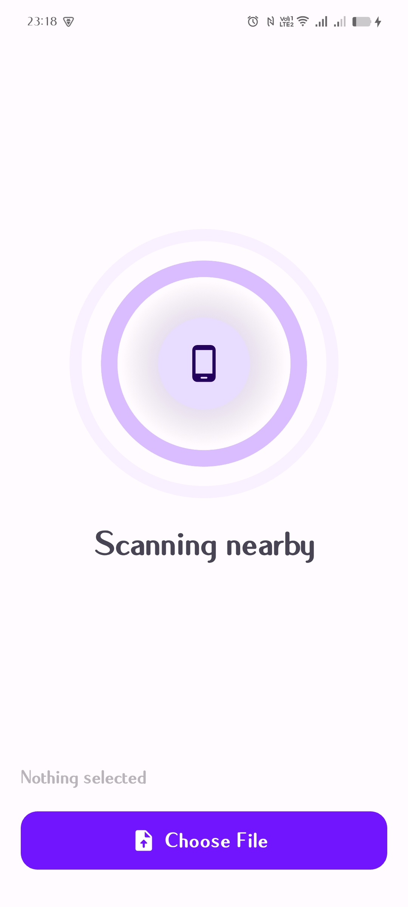
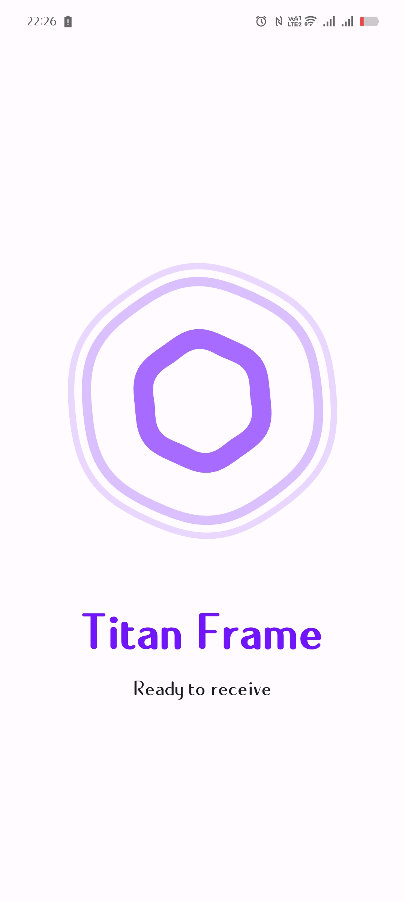
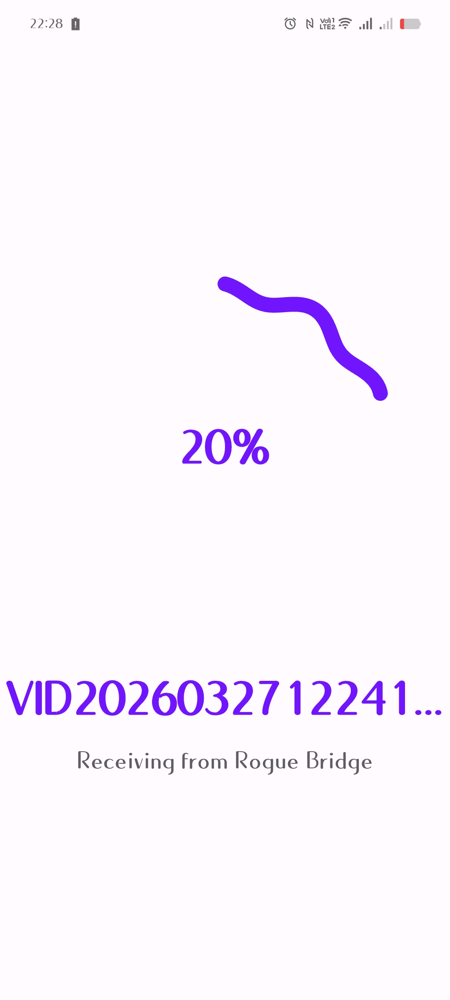
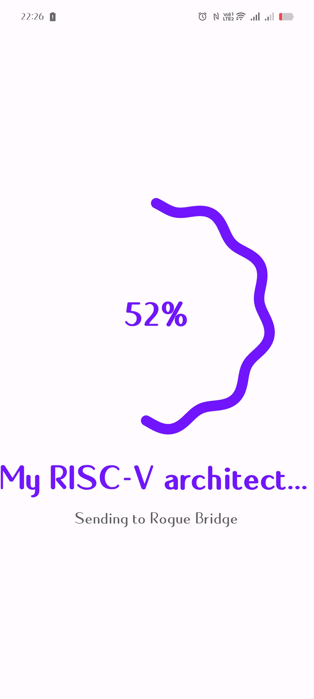

# Sefyra

Peer-to-peer file transfer for Android over local WiFi. No backend, no accounts, no cloud.

---

## Screenshots

<p align="center">
  
</p>
<p align="center">
    
    
</p>
<p align="center">
    
    
</p>

---

## How it works

Sefyra uses UDP broadcast for device discovery and TCP sockets for transfer — entirely over local WiFi. Nothing leaves your network.

- Receiver broadcasts its presence over UDP
- Sender listens and discovers nearby devices in real time
- User picks a file, taps a device
- File streams over a direct TCP connection
- Both sides track progress live; receiver saves to local storage

---

## Features

- Instant device discovery on the local network
- Real-time transfer progress on both ends
- Random device names (e.g. *Phantom Relay*, *Cobalt Surge*)
- No backend, no accounts, no cloud
- Material You theming

---

## Stack

- **Flutter** — state via `StatefulWidget` and `ValueNotifier`
- **UDP** — device discovery
- **TCP sockets** — file transfer
- `shared_preferences` — device identity persistence
- `file_picker` — file selection

---

## Project structure

```
lib/
├── main.dart
├── model/
│   └── payload.dart          # Device info model
├── services/
│   ├── tcp_client.dart       # Sender-side TCP logic
│   ├── tcp_server.dart       # Receiver-side TCP logic
│   ├── udp_fire.dart         # UDP broadcaster (receiver)
│   ├── udp_catch.dart        # UDP listener (sender)
│   ├── device_config.dart    # Device name + ID generation
│   └── ip_config.dart        # Local IP resolution
├── pages/
│   ├── send_page.dart        # Sender UI
│   └── receive_page.dart     # Receiver UI
└── widgets/
    ├── device_card.dart
    ├── file_picker_widget.dart
    ├── loading_widget.dart
    └── ripple_widget.dart
```

---

## Getting started

```bash
git clone https://github.com/vedant-dev27/sefyra.git
cd sefyra
flutter pub get
flutter run
```

Requires Android. Both devices must be on the same WiFi network.

---

## Transfer flow

```
Receiver starts UDP broadcast
Sender listens → discovers device
Sender picks file → taps device
TCP connection established
File streamed in chunks with live progress
Receiver saves file → both sides show completion
```

---

## License

MIT